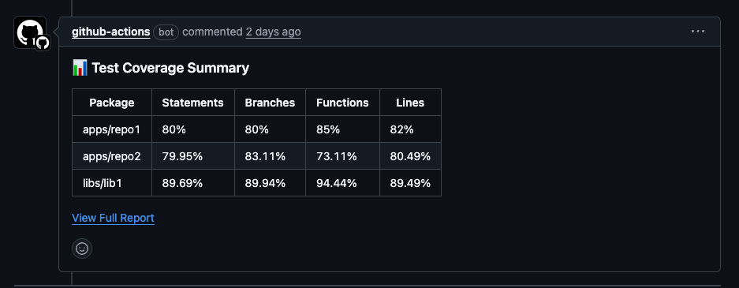

# PR Test Coverage Workflow
This document explains the GitHub Actions workflow that automatically runs tests and reports code coverage on pull requests.

**Example coverage on pull request**


## Overview
The PR Test Coverage Workflow automatically runs unit tests on packages that have changed in a pull request and posts a summary of the test coverage as a comment on the PR. This helps ensure code quality by making test coverage metrics visible to reviewers.

## Folder Structure
The workflow assumes a monorepo structure with the following layout:
``` 
repository/
├── apps/
│   ├── app1/
│   ├── app2/
│   └── ...
├── libs/
│   ├── lib1/
│   ├── lib2/
│   └── ...
└── ...
```

- `apps/`: Contains application packages
- `libs/`: Contains library packages

## How It Works
### Workflow Trigger Events
The workflow runs on:
- Pull request events (open, reopen, synchronize)
- Manual trigger via workflow_dispatch

### Steps
1. **Change Detection**
    - The workflow first identifies which packages in `apps/` and `libs/` have changed in the PR
    - It excludes certain packages (repo-x, lib-y, repo-z)
    - Creates a matrix of changed packages for parallel test execution

2. **Unit Testing**
    - For each changed package:
        - Runs Jest tests with coverage reporting
        - Extracts coverage metrics (statements, branches, functions, lines)
        - Uploads coverage reports as artifacts

3. **Coverage Summary**
    - Collects all coverage data from the test runs
    - Generates a markdown table with coverage metrics for each package
    - Posts the summary as a comment on the PR
    - Cleans up artifacts to save storage